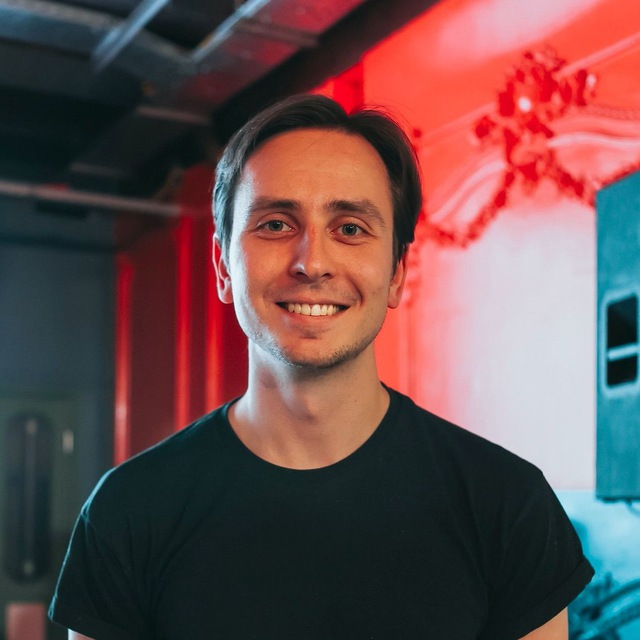
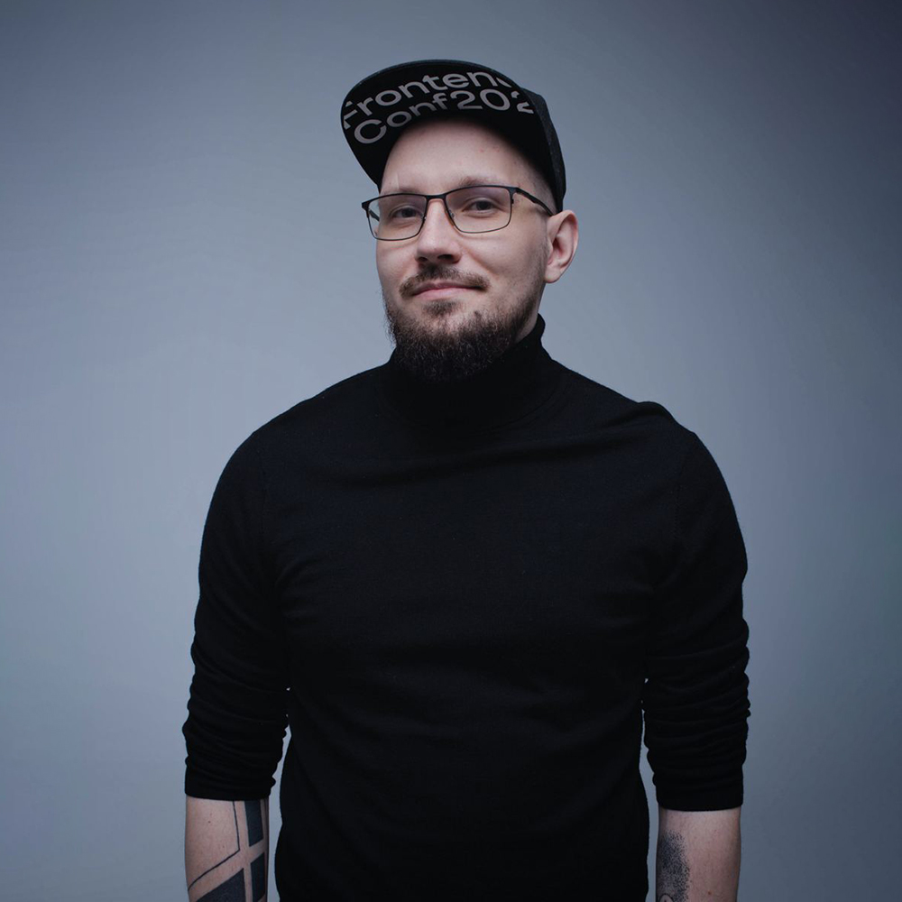

# Мы и есть фронтенд: как создается особая атмосфера FrontendConf

[Блог компании конференции Олега Бунина (Онтико)](https://habr.com/ru/company/oleg-bunin/blog/), [Программирование*](https://habr.com/ru/hub/programming/), [Управление сообществом*](https://habr.com/ru/hub/community_management/), [Конференции](https://habr.com/ru/hub/tech_events/)

[FrontendConf](https://frontendconf.ru/) входит в группу конференций Олега Бунина «Онтико». Это профессиональное мероприятие для фронтенд-разработчиков различных грейдов. Его организацией занимается программный комитет: ищет спикеров, готовит программу, помогает сделать доклады интересными и полезными. Как всё устроено изнутри и можно ли стать частью этого большого и важного дела, рассказывают члены программного комитета.

Знакомьтесь с программным комитетом [FrontendConf](https://frontendconf.ru/):

Глеб Михеев — CTO Skillbox Holding, руководитель программного комитета FrontendConf, спикер отраслевых конференций.

Андрей Смирнов — руководитель управления клиентской разработки в X5 Group. Бессменный ведущий подкаста Frontend Weekend. Участник программного комитета FrontendConf и спикер российских отраслевых конференций.

Серёжа Попов — CEO аутсорса по фронтенд-разработке Лига А. Ментор и наставник начинающих специалистов, преподаватель авторских курсов, лекций и воркшопов по фронтенд-разработке. Спикер российских и международных отраслевых конференций.

## Формируем программный комитет

Сейчас у нас в программном комитете 10 человек. Участие в программном комитете конференции — это работа, но каждый тратит на неё столько времени, сколько может. Кто-то вкладывается больше, кто-то меньше, но в результате комитет работает как единый слаженный механизм. 

Например, Саша Шинкевич и Ваня Ботанов очень много занимаются своими проектами, у них остаётся на конференцию не так много времени. Тем не менее есть моменты, когда команда целенаправленно ждёт их экспертизы.

Кто сильнее вкладывается, видно по количеству докладчиков. У одних это 15 человек, у других 3-7. Всё зависит от личной и рабочей загрузки и предварительного планирования. Также загрузка может меняться от сезона к сезону.

В программный комитет приглашают новых людей, когда возникает такая потребность — иногда кто-то покидает его «по выслуге лет», из-за переезда или рождения ребенка. Когда появляется вакантное место,  начинаются поиски нового человека с необходимой экспертизой и компетенциями. Ведь каждый участник комитета дополняет других своими навыками и умениями.

*«С 2018 года у нас сформировалась крепко сбитая команда. В неё вошли активные ребята из фронтенд-комьюнити. Каждый из нас уже прошёл определенный путь во фронтенде. В какой-то момент весь программный комитет состоял из специалистов уровня тимлида и выше. При этом экспертиза у нас сохранялась, и мы старались нивелировать недостатки друг друга, потому что ни один человек не может быть компетентным во всём. Например, Серёжа Попов знает всё про интерфейсы, дизайн, вёрстку. Я специализируюсь на тимлидерском развитии и гибких навыках. А у Глеба Михеева хорошие hard skills: он может глубоко погрузиться в Angular и другие фреймворки».*

*Андрей Смирнов*

В первую очередь при поисках обращают внимание на людей из комьюнити с опытом выступлений и «прогонов» докладов или тех, у кого есть собственное интересное видение того, какие доклады нужны конференции. Но главное, говорят в ПК, чтобы у них с новичком совпадал вайб — настроение и атмосфера.

*«Идеально, если у человека опыт от 10 лет и он регулярно выступает. Например, по этому критерию мы пригласили в комитет Алексея Авдеева и Виктора Русаковича, а еще Полину Гуртовую — она занимается фронтендом, обожает ML, много выступает и стремится шарить знания в комьюнити».*

*Глеб Михеев*

Подходит кандидат или нет, решают коллегиально. Новобранцу рассказывают о формате работы, так как важно, чтобы участники программного комитета были на одной волне. Главное, чтобы у человека горели глаза. У комитета горизонтальная структура, и если новый участник не будет справляться или не совпадёт с другими участниками по культуре, то быстро покинет команду. 

*«Не все готовы перейти от критики к делу. Бывают случаи, когда кто-то из комьюнити критикует нашу конференцию. Тогда мы предлагаем вступить в программный комитет, чтобы всё сделать лучше, но обычно слышим отказ».*

*Серёжа Попов*

## Отбираем спикеров 

Готовиться к конференции мы начинаем через несколько месяцев после окончания предыдущей. На подготовку уходит около 9-10 месяцев. Например, прошлая конференция состоялась в октябре 2021 года. Первым делом программный комитет проводит ретро, делает выводы, намечает будущие планы. Три следующих месяца обсуждает примерный пул возможных тем, а после новогодних праздников начинает продумывать треки. 

Сначала составляется так называемый call for papers, в котором описываются ожидания от докладчиков. В отличие от многих других конференций, у [FrontendConf](https://frontendconf.ru/) он достаточно сложно проработанный, детерминированный, с обоснованием важности той или иной темы. 

*«Составляя call for papers, мы пытаемся определить, чего не хватает на рынке, опрашиваем компании и обмениваемся мнением друг с другом. Ведь у каждого из нас под управлением команды, и мы знаем, с какими проблемами они сталкиваются. Наша задача — определить, какие доклады помогут решить эти проблемы».*

*Глеб Михеев*

По изменениям в программе конференции можно отследить её эволюцию. Например, в какой-то момент у нас появилось направление FrontOps, и постепенно это направление становилось всё насыщеннее. Аналогичная ситуация с микрофронтендом. А трек про CSS и HTML эволюционировал в трек про интерфейсы.

*«Нам кажется, что дождаться заявок и потом отобрать из них самые интересные — это не совсем правильный способ организовать подобную конференцию. Наше ключевое отличие от большинства конкурентов в том, что мы программу полностью собираем сами. Например, в один из сезонов мы решили включить в программу доклады про микрофронтенды и целенаправленно искали докладчиков, готовых об этом рассказать. Это не значит, что мы не берем заявки с рынка, но точно не формируем из них всю программу».*

*Серёжа Попов*

*«В этом году call for papers мы открыли 22 февраля. Время тяжёлое, поэтому заявок было совсем мало. В этой ситуации актуализировалась идея проактивно искать людей на конкретные темы. Мы закидывали докладчиков сообщениями с предложением выступить на определённую тему, писали компаниям и приглашали спикеров от них».*

*Андрей Смирнов*

У [FrontendConf](https://frontendconf.ru/) на разбор заявок уходит три месяца — только для того, чтобы утвердить темы. Ведь по каждой заявке мы обязательно созваниваемся и обсуждаем тему со спикером. Разговор длится от 15 минут до получаса в зависимости от темы и количества материала. Эта беседа позволяет предварительно понять, какой из человека выйдет спикер, задать ему вопросы: что он пытается донести до аудитории, с чем аудитория должна выйти из зала, почему он пришёл к этой теме. 

Исходя из полученных ответов, уже можно сделать вывод, как человек говорит, насколько умеет использовать жестикуляцию, умеет ли донести свою мысль или какой-то спорный тезис, насколько увлечён темой. 

*«Однажды к нам с докладом подался человек, а потом его выступление отменилось из-за семейных обстоятельств. Тогда он предложил заменить его коллегой, который выступит с той же самой темой. Мы считаем такой подход неправильным. Между темой и докладчиком должна быть синергия, тогда выступление получится действительно хорошим».*

*Андрей Смирнов*

Подавая заявку в call for papers, спикер может приложить видео предыдущих докладов, презентации, статьи. Это нужно нам для понимания, войдёт ли человек в программу, как хорошо он готовит презентации, как говорит, как держится на сцене. Чем больше у нас есть такой вводной фактуры, тем проще принять решение. Поэтому часто после ознакомительного созвона программный комитет просит прислать дополнительные материалы.
Очень важны спикеры, которые будут выступать впервые. Много сильных докладчиков сейчас уехали из страны и не собираются возвращаться назад. Но есть огромное количество классных молодых инженеров, которые хорошо разбираются в своем деле. 

*«Эти молодые спикеры ещё никогда не выступали, но у них хорошее понимание темы. На этой конференции у меня будут выступать с классными темами ребята из ВК, практически все в первый раз. Вопрос только к подготовке. Ведь программный комитет не только отбирает заявки и темы, но и серьёзно помогает с докладом. У нас бывали случаи, когда докладчики без опыта выступления блестяще выступали и входили в топ докладчиков! Да, им было тяжело, они волновались, но мы помогали подготовиться, устраивали очные прогоны. С одним из них мы восемь раз созванивались перед выходом на сцену и сняли огромное количество барьеров, которые мешают выступать».*

*Серёжа Попов*

Необязательно подавать заявку, только если уверены, что вы шикарный спикер. В первую очередь важна тема, экспертиза и желание. При этих составляющих с определёнными усилиями можно при помощи программного комитета значительно усовершенствовать доклад. 

*«Мы выполняем роль некоего буткемпа для докладчиков. Главное — гореть темой. А мы поможем добиться хорошего результата или честно скажем, если задатков для выступлений нет и лучше попробовать себя в чём-то другом. Но если вы прошли отбор, обещаем помогать и не жалеть на это времени».*

*Андрей Смирнов*

## Формируем программу

Когда заявки утверждены, получается список из тем, между которыми нужно установить логические связи, чтобы получились интересные взаимодействия. Таким образом, например, получился суперсет про инженерное развитие. Целый день можно посещать доклады только по этой теме, начиная с того, как составить свой индивидуальный план развития, заканчивая тем, как техлиду или тимлиду собеседовать людей. 

*«У нас не было нужного количества заявок по этой теме, и мы «добирали» докладчиков самостоятельно. Так вырисовывается карта того, что мы хотим видеть на конференции. Она основывается на поданных заявках, а потом дополняется нашей экспертизой и активными стратегическими действиями организаторов».*

*Андрей Смирнов*

*«Например, в прошлом году нам были интересны монорепозитории, и мы пригласили выступать Игоря Кацубу. В этом году нам важно сделать доклад про роль архитектора ПО — мы нашли Романа Хаимова, который про это расскажет. Плюс мы сами много выступаем на конференциях, видим хороших докладчиков, помогаем с новыми темами. Так мы пересобрали доклад Алексея Попкова про импакт-анализ».*

*Глеб Михеев*

В каждый трек входит от 5 до 7 докладов. Гости конференции обычно приходят с конкретным запросом. Например, прокачаться во FrontOps. А компании отправляют к нам своих сотрудников, чтобы они подтянули свои навыки. Поэтому организаторы стараются дать больше, чем просто возможность посмотреть один полезный доклад. 

Так, например, и появился формат суперсета про микрофронтенды. В последнее время заявки на доклады с этой темой стали подаваться чаще. Cо временем ведущие компании накопили опыт и хотят им делиться. Чтобы усилить этот блок, обратились в компанию Тинькофф, у которой большой опыт в теме. Вспомнили также про спикера с прошлогодней конференции из компании Cloud (ранее SberCloud). Предложили рассказать о технических аспектах работы с этой технологией. 

В результате несколько спикеров последовательно рассказывают о своём практическом опыте по микрофронтендам.

*«Начинается суперсет с проблематики масштабирования, как работает решение, как масштабировать микрофронтенды на большой коллектив с точки зрения инженерки, как автоматизировать этот процесс до уровня low-code решения, и в конце — а как теперь со всем этим жить командам и как изменяются их процессы работы, деплоя и обслуживания. Завершается это всё мастер-классом докладчика, который ещё в 2018 году выступал с докладом о микрофронтендах. Он передаст свой опыт по написанию микрофронтендов тем, кому интересно, как реализовать инфраструктуру для микрофронтендов с нуля.

А иногда можем и пошутить. Например, поставить трёх спикеров с одинаковой фамилией в один день. В этом году у нас есть Дмитрий Захаров, Зар Захаров и Владимир Захаров. Все они открывают конференцию. У них разные темы, которые прекрасно встают в открывающие слоты параллельно друг с другом».*

*Глеб Михеев*
